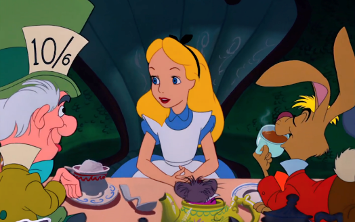

```{r, include=FALSE}
# Load packages
library(dplyr)
library(tidyr)
library(forcats)

library(ggplot2)
library(fmsb) #radarchart
library(knitr)
library(kableExtra)

library(FactoMineR)
library(factoextra)
library(foreign)

library(stats)
library(clustMixType)
library(klaR)
```


```{r, include=FALSE}
# Load data
survey <- read.csv("kaggle_survey_2020_responses.csv")[-1, -1]

for (i in 1:(dim(survey)[2]) ) {
  survey[,i] <- as.factor(survey[,i])
}
```

Welcome to the Wonderland of Data Science!

Our analysis uses data from 20,036 responses in the Kaggle’s 2020 survey. Although the survey is limited to the Kaggle community, we believe the insights about these Kagglers will not only apply to our community, but also generalize to a larger data science community in which we better understand the roadmap that people are taking, the tools that people are developing, and the language that people are using to communicate about data science nowadays. We decide to tell our story by means of radar chart as we want to focus on the behavioral tendencies of the respondents and compare the trends between different detected groups of data scientists within the Kaggle community.

Just like Alice going on an adventure to the Wonderland, no matter where you are on the data science path, you will definitely "grow up" and survive in this confusing yet very exciting world. We hope our analysis will serve to guide you through the world of data science and help you stay up to date with the latest trends in the field. Now, let's get started!


# Method

In this analysis, we aim to detect different groups of data scientists within the Kaggle community using clustering technique. Questions 1, 2, 3, 4, 6, and 15 are selected as input features for clustering since demographics, education, and years of experience are all fixed properties representative of an indivdual. The input questions are as below:

* Q1: What is your age (#years)?
* Q2: What is your gender?
* Q3: In which country do you currently reside?
* Q4: What is the highest level of formal education that you have attained or plan to attain within the next 2 years?
* Q6: For how many years have you been writing code and/or programming?
* Q15: For how many years have you used machine learning methods?

Given the clusters, individuals excluded from the survey will be able to identify the group most relevant to them based on their background information and gain useful insights regarding data science career tracks, technical skills, and learning resources through our analysis.

```{r, include=FALSE}
input_data <- survey %>%
  dplyr::select(Q1, Q2, Q3, Q4, Q6, Q15)
```

```{r, include=FALSE}
input_data$Q3_Continent <- ""

# Africa
input_data$Q3_Continent[input_data$Q3 == "Algeria"] <- "Africa" 
input_data$Q3_Continent[input_data$Q3 == "Ghana"] <- "Africa" 
input_data$Q3_Continent[input_data$Q3 == "Egypt"] <- "Africa" 
input_data$Q3_Continent[input_data$Q3 == "Kenya"] <- "Africa" 
input_data$Q3_Continent[input_data$Q3 == "Morocco"] <- "Africa" 
input_data$Q3_Continent[input_data$Q3 == "Nigeria"] <- "Africa"
input_data$Q3_Continent[input_data$Q3 == "South Africa"] <- "Africa" 

# Asia
input_data$Q3_Continent[input_data$Q3 == "Bangladesh"] <- "Asia"
input_data$Q3_Continent[input_data$Q3 == "China"] <- "Asia" 
input_data$Q3_Continent[input_data$Q3 == "Hong Kong (S.A.R.)"] <- "Asia" 
input_data$Q3_Continent[input_data$Q3 == "India"] <- "Asia" 
input_data$Q3_Continent[input_data$Q3 == "Indonesia"] <- "Asia" 
input_data$Q3_Continent[input_data$Q3 == "Indonesia"] <- "Asia" 
input_data$Q3_Continent[input_data$Q3 == "Iran, Islamic Republic of..."] <- "Asia" 
input_data$Q3_Continent[input_data$Q3 == "Japan"] <- "Asia" 
input_data$Q3_Continent[input_data$Q3 == "Malaysia"] <- "Asia"
input_data$Q3_Continent[input_data$Q3 == "Pakistan"] <- "Asia" 
input_data$Q3_Continent[input_data$Q3 == "Philippines"] <- "Asia"
input_data$Q3_Continent[input_data$Q3 == "Republic of Korea"] <- "Asia" 
input_data$Q3_Continent[input_data$Q3 == "Saudi Arabia"] <- "Asia" 
input_data$Q3_Continent[input_data$Q3 == "Singapore"] <- "Asia" 
input_data$Q3_Continent[input_data$Q3 == "South Korea"] <- "Asia"
input_data$Q3_Continent[input_data$Q3 == "Sri Lanka"] <- "Asia" 
input_data$Q3_Continent[input_data$Q3 == "Taiwan"] <- "Asia" 
input_data$Q3_Continent[input_data$Q3 == "Thailand"] <- "Asia"
input_data$Q3_Continent[input_data$Q3 == "Tunisia"] <- "Asia"
input_data$Q3_Continent[input_data$Q3 == "Turkey"] <- "Asia" 
input_data$Q3_Continent[input_data$Q3 == "Viet Nam"] <- "Asia" 

# Europe
input_data$Q3_Continent[input_data$Q3 == "Austria"] <- "Europe"
input_data$Q3_Continent[input_data$Q3 == "Belgium"] <- "Europe"
input_data$Q3_Continent[input_data$Q3 == "Bulgaria"] <- "Europe"
input_data$Q3_Continent[input_data$Q3 == "Croatia"] <- "Europe"
input_data$Q3_Continent[input_data$Q3 == "Czech Republic"] <- "Europe"
input_data$Q3_Continent[input_data$Q3 == "Denmark"] <- "Europe"
input_data$Q3_Continent[input_data$Q3 == "Estonia"] <- "Europe"
input_data$Q3_Continent[input_data$Q3 == "Finland"] <- "Europe"
input_data$Q3_Continent[input_data$Q3 == "France"] <- "Europe"
input_data$Q3_Continent[input_data$Q3 == "Germany"] <- "Europe"
input_data$Q3_Continent[input_data$Q3 == "Greece"] <- "Europe"
input_data$Q3_Continent[input_data$Q3 == "Hungary"] <- "Europe"
input_data$Q3_Continent[input_data$Q3 == "Ireland"] <- "Europe"
input_data$Q3_Continent[input_data$Q3 == "Italy"] <- "Europe"
input_data$Q3_Continent[input_data$Q3 == "Lativia"] <- "Europe"
input_data$Q3_Continent[input_data$Q3 == "Lithuania"] <- "Europe"
input_data$Q3_Continent[input_data$Q3 == "Netherlands"] <- "Europe"
input_data$Q3_Continent[input_data$Q3 == "Poland"] <- "Europe"
input_data$Q3_Continent[input_data$Q3 == "Portugal"] <- "Europe"
input_data$Q3_Continent[input_data$Q3 == "Romania"] <- "Europe"
input_data$Q3_Continent[input_data$Q3 == "Slovakia"] <- "Europe"
input_data$Q3_Continent[input_data$Q3 == "Slovenia"] <- "Europe"
input_data$Q3_Continent[input_data$Q3 == "Spain"] <- "Europe"
input_data$Q3_Continent[input_data$Q3 == "Sweden"] <- "Europe"
input_data$Q3_Continent[input_data$Q3 == "United Kingdom of Great Britain and Northern Ireland"] <- "Europe"
input_data$Q3_Continent[input_data$Q3 == "Russia"] <- "Europe"
input_data$Q3_Continent[input_data$Q3 == "Switzerland"] <- "Europe"
input_data$Q3_Continent[input_data$Q3 == "Ukraine"] <- "Europe"
input_data$Q3_Continent[input_data$Q3 == "Belarus"] <- "Europe"
input_data$Q3_Continent[input_data$Q3 == "Norway"] <- "Europe"

# North America
input_data$Q3_Continent[input_data$Q3 == "Canada"] <- "North America" 
input_data$Q3_Continent[input_data$Q3 == "Mexico"] <- "North America" 
input_data$Q3_Continent[input_data$Q3 == "United States of America"] <- "North America" 

# South America
input_data$Q3_Continent[input_data$Q3 == "Argentina"] <- "South America" 
input_data$Q3_Continent[input_data$Q3 == "Brazil"] <- "South America" 
input_data$Q3_Continent[input_data$Q3 == "Chile"] <- "South America" 
input_data$Q3_Continent[input_data$Q3 == "Colombia"] <- "South America" 
input_data$Q3_Continent[input_data$Q3 == "Peru"] <- "South America" 

# Oceania
input_data$Q3_Continent[input_data$Q3 == "Australia"] <- "Oceania" 
input_data$Q3_Continent[input_data$Q3 == "New Zealand"] <- "Oceania" 

# Other
input_data$Q3_Continent[input_data$Q3 == "Other"] <- "Other"


input_data <- input_data %>%
  mutate(Q3_Continent = as.factor(Q3_Continent)) %>%
  dplyr::select(-Q3)
```


## Dimension Reduction

Since we have 6 input questions corresponding to 6 dimensions, summarizing and visualizing data can be difficult while clustering might be ineffective in high-dimensional space. To overcome these limitations, we propose first using [correspondence analysis (CA)](https://en.wikipedia.org/wiki/Correspondence_analysis), an extension of principal component analysis suited to explore relationships among qualitative variables. This technique is generally used to analyze a data set from survey to identify the associations between variable categories. Since our data contains more than two categorical variables, we choose to use [multiple correspondence analysis (MCA)](https://en.wikipedia.org/wiki/Multiple_correspondence_analysis) as it can be applied to input of multiple dimensions. However, MCA has a disadvantage that it tends not to explain all the variance while looking at associations. For the purpose of this analysis, we select the first two dimensions which altogether account for 10.5% of the total variances in the survey's answers.

```{r, include=FALSE}
mca <- MCA(input_data, ncp = 2, graph = FALSE)

fviz_mca_var(mca, choice = "mca.cor", 
            repel = TRUE, # Avoid text overlapping (slow)
            ggtheme = theme_minimal())
```

## Clustering Analysis

Our goal is to better understand the specific communities represented in the survey. Thus, we propose using [K-means clustering](https://en.wikipedia.org/wiki/K-means_clustering), one of the simplest and most popular clustering that aims to group similar data points together and discover underlying patterns. To process the learning data and detect clusters, K-means identifies *k* number of centroids, and then allocates every data point to the nearest cluster, while keeping the centroids as small as possible. After examining different possible values of *k*, we decide to pick *k = 3*. This will help the model to avoid overfitting while ensuring its descriptive performance. Contextually, we believe 3 is a suitable number of groups of similar respondents that will allow us to dive deep into the survey dataset and tell the diverse stories of data scientists from around the world.

```{r, include=FALSE}
set.seed(2020)

kmeans <- kmeans(mca$ind$coord, centers = 3, nstart = 20)
cluster <- as.factor(kmeans$cluster)

input_cluster <- cbind(input_data, mca$ind$coord, cluster)

ggplot(input_cluster, aes(`Dim 1`, `Dim 2`, color = cluster)) + geom_point() + theme_minimal()
```


```{r, include=FALSE}
get_mode <- function(v) {
  # Remove empty value
  v <- as.data.frame(v)
  v <- as.factor(v[v != ""])
  uniqv <- unique(v)
  uniqv[which.max(tabulate(match(v, uniqv)))]
}
```

Now that we have found the clusters of similar respondents from the survey, we will next examine the types of data scientists within the Kaggle community that these clusters represent. Since our variables are all categorical, we choose to calculate the mode to measure the central tendency of each variable. Below is the table of cluster distribution with the corresponding mode values of the input questions:

```{r, message=FALSE, warning=FALSE, echo=FALSE}
clust_info <- input_cluster %>%
  group_by(cluster) %>%
  summarize(Count = n(),
            Age = get_mode(Q1),
            Continent = get_mode(Q3_Continent),
            Degree = get_mode(Q4),
            `Years of Coding` = get_mode(Q6),
            `Years of ML` = get_mode(Q15)) %>%
  mutate(Degree2 = ifelse(Degree == "Master’s degree", "Master's degree", ifelse(Degree == "Bachelor’s degree", "Bachelor's degree", Degree))) %>%
  mutate(Group = c("Experts", "Junior Players", "Amateur Outsiders")) %>%
  dplyr::select(Group, Count, Age, Continent, Degree, `Years of Coding`, `Years of ML`)

clust_info %>%
  kable(align = "c") %>%
  kable_styling("hover", full_width = F)
```

Overall, there are three representatives in the Kaggle community:

* Amateur Outsiders

<center>


</center>

The first group consists of individuals in the age of 25-29, mostly with a Bachelor's degree but neither coding nor machine learning experience. They seem to be the amateur outsiders with some interest in data science and would like to know more or enter the field. This group is the smallest of the three groups, accounting for roughly 10% of the sample.


* Junior Players

<center>



</center>

The second group consists of individuals in the age of 22- 24, mostly with a Bachelor's degree and some years of coding but not much machine learning experience. They seem to be fresh graduates or beginners in the data science world who already know what’s in there and are on the way of discovering more about the path. This group is the largest among the three groups, accounting for roughly 60% of the sample.

* Experts

<center>


</center>

The third group consists of individuals in the age of 30 – 35, mostly with a Master's degree and many years of both coding and machine learning experience. We can call them the experts of the game as they seem to be much more proficient in data science more than anyone else. This group is the second largest among the three groups, accounting for roughly 30% of the sample.


# Findings

## Insights about career tracks

* Q5: Select the title most similar to your current role (or most recent title if retired)

```{r, warning=FALSE, message=FALSE, echo=FALSE, fig.height=5, fig.width=15, out.retina=1}
q5 <- survey %>% dplyr::select(Q5)

q5_cluster <- cbind(q5, cluster)

q5_cluster <- q5_cluster %>%
  group_by(cluster, Q5) %>%
  summarize(count = n())

# Remove rows with empty string
q5_cluster <- q5_cluster[!apply(q5_cluster, 1, function(x) any(x == "")),] 

# Turn data into wide format
q5_cluster <- q5_cluster %>% pivot_wider(id_cols = cluster, names_from = Q5, values_from = count)
q5_cluster <- q5_cluster[, -1]

# Filter each cluster
q5_cluster_1 <- q5_cluster[1,]
q5_cluster_2 <- q5_cluster[2,]
q5_cluster_3 <- q5_cluster[3,]

# Plot radar chart
layout(matrix(c(1, 2, 3), nrow = 1, byrow = TRUE))

q5_cluster_1 <- rbind(rep(max(q5_cluster_1),13), rep(0,13), q5_cluster_1)
radarchart(q5_cluster_1, title = "Experts", 
           pcol = '#FCC02A', pfcol = alpha('#FDDF94', 0.3), plwd = 2,
           cglcol = "grey", cglty = 1, axislabcol = "grey", caxislabels = seq(0,20,5), cglwd = 0.8)

q5_cluster_2 <- rbind(rep(max(q5_cluster_2),13), rep(0,13), q5_cluster_2)
radarchart(q5_cluster_2, title = "Junior Players",
           pcol = '#01B6BD', pfcol = alpha('#80DADE', 0.3), plwd = 2,
           cglcol = "grey", cglty = 1, axislabcol = "grey", caxislabels = seq(0,20,5), cglwd = 0.8)

q5_cluster_3 <- rbind(rep(max(q5_cluster_3),13), rep(0,13), q5_cluster_3)
radarchart(q5_cluster_3, title = "Amateur Outsiders",
           pcol = '#7A4D96', pfcol = alpha('#BCA6CA', 0.3), plwd = 2,
           cglcol = "grey", cglty = 1, axislabcol = "grey", caxislabels = seq(0,20,5), cglwd = 0.8)
```

This observation closely matches our expectation about the current roles of the three groups: the experts are mostly scientists and researchers; the junior players are mainly students or working at various positions within the data science field; and the amateur outsiders are either unemployed, not working in the field (others), or even students as they could be pursuing a Master's or a Bachelor's degree in another field.


* Q20: What is the size of the company where you are employed?

```{r, warning=FALSE, message=FALSE, echo=FALSE, fig.height=5, fig.width=15, out.retina=1}
q20 <- survey %>% dplyr::select(Q20)

q20_cluster <- cbind(q20, cluster)

q20_cluster <- q20_cluster %>%
  group_by(cluster, Q20) %>%
  summarize(count = n())

# Remove rows with empty string
q20_cluster <- q20_cluster[!apply(q20_cluster, 1, function(x) any(x == "")),] 

# Turn data into wide format
q20_cluster <- q20_cluster %>% pivot_wider(id_cols = cluster, names_from = Q20, values_from = count)
q20_cluster <- q20_cluster[, -1]

# Filter each cluster
q20_cluster_1 <- q20_cluster[1,]
q20_cluster_2 <- q20_cluster[2,]
q20_cluster_3 <- q20_cluster[3,]

# Plot radar chart
layout(matrix(c(1, 2, 3), nrow = 1, byrow = TRUE))

q20_cluster_1 <- rbind(rep(max(q20_cluster_1),5), rep(0,5), q20_cluster_1)
radarchart(q20_cluster_1, title = "Experts", 
           pcol = '#FCC02A', pfcol = alpha('#FDDF94', 0.3), plwd = 2,
           cglcol = "grey", cglty = 1, axislabcol = "grey", caxislabels = seq(0,20,5), cglwd = 0.8)

q20_cluster_2 <- rbind(rep(max(q20_cluster_2),5), rep(0,5), q20_cluster_2)
radarchart(q20_cluster_2, title = "Junior Players",
           pcol = '#01B6BD', pfcol = alpha('#80DADE', 0.3), plwd = 2,
           cglcol = "grey", cglty = 1, axislabcol = "grey", caxislabels = seq(0,20,5), cglwd = 0.8)

q20_cluster_3 <- rbind(rep(max(q20_cluster_3),5), rep(0,5), q20_cluster_3)
radarchart(q20_cluster_3, title = "Amateur Outsiders",
           pcol = '#7A4D96', pfcol = alpha('#BCA6CA', 0.3), plwd = 2,
           cglcol = "grey", cglty = 1, axislabcol = "grey", caxislabels = seq(0,20,5), cglwd = 0.8)
```


* Q21: Approximately how many individuals are responsible for data science workloads at your place at business?

```{r, warning=FALSE, message=FALSE, echo=FALSE, fig.height=5, fig.width=15, out.retina=1}
q21 <- survey %>% dplyr::select(Q21)

q21_cluster <- cbind(q21, cluster)

q21_cluster <- q21_cluster %>%
  group_by(cluster, Q21) %>%
  summarize(count = n())

# Remove rows with empty string
q21_cluster <- q21_cluster[!apply(q21_cluster, 1, function(x) any(x == "")),] 

# Turn data into wide format
q21_cluster <- q21_cluster %>% pivot_wider(id_cols = cluster, names_from = Q21, values_from = count)
q21_cluster <- q21_cluster[, -1]

# Filter each cluster
q21_cluster_1 <- q21_cluster[1,]
q21_cluster_2 <- q21_cluster[2,]
q21_cluster_3 <- q21_cluster[3,]

# Plot radar chart
layout(matrix(c(1, 2, 3), nrow = 1, byrow = TRUE))

q21_cluster_1 <- rbind(rep(max(q21_cluster_1),7), rep(0,7), q21_cluster_1)
radarchart(q21_cluster_1, title = "Experts", 
           pcol = '#FCC02A', pfcol = alpha('#FDDF94', 0.3), plwd = 2,
           cglcol = "grey", cglty = 1, axislabcol = "grey", caxislabels = seq(0,20,5), cglwd = 0.8)

q21_cluster_2 <- rbind(rep(max(q21_cluster_2),7), rep(0,7), q21_cluster_2)
radarchart(q21_cluster_2, title = "Junior Players",
           pcol = '#01B6BD', pfcol = alpha('#80DADE', 0.3), plwd = 2,
           cglcol = "grey", cglty = 1, axislabcol = "grey", caxislabels = seq(0,20,5), cglwd = 0.8)

q21_cluster_3 <- rbind(rep(max(q21_cluster_3),7), rep(0,7), q21_cluster_3)
radarchart(q21_cluster_3, title = "Amateur Outsiders",
           pcol = '#7A4D96', pfcol = alpha('#BCA6CA', 0.3), plwd = 2,
           cglcol = "grey", cglty = 1, axislabcol = "grey", caxislabels = seq(0,20,5), cglwd = 0.8)
```

In terms of company size, the three groups all have similar shape in which ‘0-44 employees’ is the most popular size. However, the experts are likely to work for companies with bigger scope as they tend to have more individuals responsible for data science workloads at business, as opposed to the juniors and outsiders who might be still in school or working for compaies with smaller scope.


* Q22: Does your current employer incorporate machine learning methods into their business?

```{r, warning=FALSE, message=FALSE, echo=FALSE, fig.height=5, fig.width=15, out.retina=1}
q22 <- survey %>% dplyr::select(Q22)

q22_cluster <- cbind(q22, cluster)

q22_cluster <- q22_cluster %>%
  group_by(cluster, Q22) %>%
  summarize(count = n())

# Remove rows with empty string
q22_cluster <- q22_cluster[!apply(q22_cluster, 1, function(x) any(x == "")),] 

# Turn data into wide format
q22_cluster <- q22_cluster %>% pivot_wider(id_cols = cluster, names_from = Q22, values_from = count)
q22_cluster <- q22_cluster[, -1]
colnames(q22_cluster) <- c("I don’t know", "Not using ML", "Exploring ML", "Have well-established ML", "Recently started ML", "Use ML for insights")

# Filter each cluster
q22_cluster_1 <- q22_cluster[1,]
q22_cluster_2 <- q22_cluster[2,]
q22_cluster_3 <- q22_cluster[3,]

# Plot radar chart
layout(matrix(c(1, 2, 3), nrow = 1, byrow = TRUE))

q22_cluster_1 <- rbind(rep(max(q22_cluster_1),6), rep(0,6), q22_cluster_1)
radarchart(q22_cluster_1, title = "Experts", 
           pcol = '#FCC02A', pfcol = alpha('#FDDF94', 0.3), plwd = 2,
           cglcol = "grey", cglty = 1, axislabcol = "grey", caxislabels = seq(0,20,5), cglwd = 0.8)

q22_cluster_2 <- rbind(rep(max(q22_cluster_2),6), rep(0,6), q22_cluster_2)
radarchart(q22_cluster_2, title = "Junior Players",
           pcol = '#01B6BD', pfcol = alpha('#80DADE', 0.3), plwd = 2,
           cglcol = "grey", cglty = 1, axislabcol = "grey", caxislabels = seq(0,20,5), cglwd = 0.8)

q22_cluster_3 <- rbind(rep(max(q22_cluster_3),6), rep(0,6), q22_cluster_3)
radarchart(q22_cluster_3, title = "Amateur Outsiders",
           pcol = '#7A4D96', pfcol = alpha('#BCA6CA', 0.3), plwd = 2,
           cglcol = "grey", cglty = 1, axislabcol = "grey", caxislabels = seq(0,20,5), cglwd = 0.8)
```

The experts mostly work at places where machine learning methods have been well established while the juniors work at the place where machine learning method are being explored, and the outsiders tend to work at places where people do not exploit machine learning. Intuitively, this makes perfect sense as the experts are the ones having the most years of machine learning experience, while the juniors and outsiders have not had much experience with machine learning.


* Q23: Select any activities that make up an important part of your role at work

```{r, warning=FALSE, message=FALSE, echo=FALSE, fig.height=5, fig.width=15, out.retina=1}
q23 <- survey %>%
  dplyr::select(Q23_Part_1, Q23_Part_2, Q23_Part_3, Q23_Part_4, Q23_Part_5, Q23_Part_6, Q23_Part_7, Q23_OTHER)

q23_cluster <- cbind(q23, cluster)

q23_cluster <- q23_cluster %>%
  group_by(cluster) %>%
  summarize(`Analyze and understand data for decision intelligence` = sum(Q23_Part_1 != ""),
            `Build data infrastructure for data insights` = sum(Q23_Part_2 != ""),
            `Build ML prototypes` = sum(Q23_Part_3 != ""),
            `Build ML services for operations` = sum(Q23_Part_4 != ""),
            `Improve existing ML models` = sum(Q23_Part_5 != ""),
            `Do research to advance ML` = sum(Q23_Part_6 != ""),
            `None of these activities` = sum(Q23_Part_7 != ""),
            `Other` = sum(Q23_OTHER != ""))

rownames(q23_cluster) <- q23_cluster$cluster
q23_cluster <- q23_cluster[, -c(1, 1)]

# Filter each cluster
q23_cluster_1 <- q23_cluster[1,]
q23_cluster_2 <- q23_cluster[2,]
q23_cluster_3 <- q23_cluster[3,]

# Plot radar chart
layout(matrix(c(1, 2, 3), nrow = 1, byrow = TRUE))

q23_cluster_1 <- rbind(rep(max(q23_cluster_1),8), rep(0,8), q23_cluster_1)
radarchart(q23_cluster_1, title = "Experts", 
           pcol = '#FCC02A', pfcol = alpha('#FDDF94', 0.3), plwd = 2,
           cglcol = "grey", cglty = 1, axislabcol = "grey", caxislabels = seq(0,20,5), cglwd = 0.8)

q23_cluster_2 <- rbind(rep(max(q23_cluster_2),8), rep(0,8), q23_cluster_2)
radarchart(q23_cluster_2, title = "Junior Players",
           pcol = '#01B6BD', pfcol = alpha('#80DADE', 0.3), plwd = 2,
           cglcol = "grey", cglty = 1, axislabcol = "grey", caxislabels = seq(0,20,5), cglwd = 0.8)

q23_cluster_3 <- rbind(rep(max(q23_cluster_3),8), rep(0,8), q23_cluster_3)
radarchart(q23_cluster_3, title = "Amateur Outsiders",
           pcol = '#7A4D96', pfcol = alpha('#BCA6CA', 0.3), plwd = 2,
           cglcol = "grey", cglty = 1, axislabcol = "grey", caxislabels = seq(0,20,5), cglwd = 0.8)
```

As indicated in Q5, the experts are likely to be data scientists and researchers, therefore their work will also focus on building/running prototypes to explore applying machine learning to new areas in addition to supporting business decisions with their data analysis. The junior players and amateur outsiders are expected to be entry-level data analysts or business analysts whose responsibilities simply focus on analyzing and understand data to support business and products.


* Q24: What is your current yearly compensation (approximate $USD)?

```{r, warning=FALSE, message=FALSE, echo=FALSE, fig.height=5, fig.width=15, out.retina=1}
q24 <- survey %>% 
  mutate(Q24_Level = ifelse(Q24 %in% c(""), "", ifelse(Q24 %in% c("$0-999", "1,000-1,999", "2,000-2,999", "3,000-3,999", "4,000-4,999", "5,000-7,499", "7,500-9,999", "10,000-14,999", "15,000-19,999", "20,000-24,999", "25,000-29,999", "30,000-39,999", "40,000-49,999"), "Level 1 ($0-49,999)", ifelse(Q24 %in% c("50,000-59,999", "60,000-69,999", "70,000-79,999", "80,000-89,999", "90,000-99,999"), "Level 2 ($50,000-99,999)", ifelse(Q24 %in% c("100,000-124,999", "125,000-149,999"), "Level 3 ($100,000-149,999)", ifelse(Q24 %in% c("150,000-199,999"), "Level 4 ($150,000-199,999)", ifelse(Q24 %in% c("200,000-249,999", "250,000-299,999"), "Level 5 ($200,000-299,999)", ifelse(Q24 %in% c("300,000-500,000"), "Level 6 ($300,000-500,000)", "Level  7 (> $500,000)")))))))) %>%
  dplyr::select(Q24, Q24_Level)

q24_cluster <- cbind(q24, cluster)

q24_cluster <- q24_cluster %>%
  group_by(cluster, Q24_Level) %>%
  summarize(count = n())

# Remove rows with empty string
q24_cluster <- q24_cluster[!apply(q24_cluster, 1, function(x) any(x == "")),] 

# Turn data into wide format
q24_cluster <- q24_cluster %>% pivot_wider(id_cols = cluster, names_from = Q24_Level, values_from = count)
q24_cluster <- q24_cluster[, -1]

# Filter each cluster
q24_cluster_1 <- q24_cluster[1,]
q24_cluster_2 <- q24_cluster[2,]
q24_cluster_3 <- q24_cluster[3,]

# Plot radar chart
layout(matrix(c(1, 2, 3), nrow = 1, byrow = TRUE))

q24_cluster_1 <- rbind(rep(max(q24_cluster_1),7), rep(0,7), q24_cluster_1)
radarchart(q24_cluster_1, title = "Experts", 
           pcol = '#FCC02A', pfcol = alpha('#FDDF94', 0.3), plwd = 2,
           cglcol = "grey", cglty = 1, axislabcol = "grey", caxislabels = seq(0,20,5), cglwd = 0.8)

q24_cluster_2 <- rbind(rep(max(q24_cluster_2),7), rep(0,7), q24_cluster_2)
radarchart(q24_cluster_2, title = "Junior Players",
           pcol = '#01B6BD', pfcol = alpha('#80DADE', 0.3), plwd = 2,
           cglcol = "grey", cglty = 1, axislabcol = "grey", caxislabels = seq(0,20,5), cglwd = 0.8)

q24_cluster_3 <- rbind(rep(max(q24_cluster_3),7), rep(0,7), q24_cluster_3)
radarchart(q24_cluster_3, title = "Amateur Outsiders",
           pcol = '#7A4D96', pfcol = alpha('#BCA6CA', 0.3), plwd = 2,
           cglcol = "grey", cglty = 1, axislabcol = "grey", caxislabels = seq(0,20,5), cglwd = 0.8)
```

How much can you make with a data science job? This question is always of people’s interest, especially those who just enter the field or are thinking about switching to data science from another field. According to the results in Q24, the beginners are likely to be paid up to \$50 but no more than \$150K. Fortunately, the salary for the experts is expected to be in a larger range from 0 – \$50K to \$100K – \$150K or even more than \$200K, implying that compensation is likely to increase as you improve your skills and move up the ladder over time.


## Insights about technical skills

* Q7: What programming languages do you use on a regular basis?

```{r, warning=FALSE, message=FALSE, echo=FALSE, fig.height=5, fig.width=15, out.retina=1}
q7 <- survey %>%
  dplyr::select(Q7_Part_1, Q7_Part_2, Q7_Part_3, Q7_Part_4, Q7_Part_5, Q7_Part_6, Q7_Part_7, Q7_Part_8, Q7_Part_9, Q7_Part_10, Q7_Part_11, Q7_Part_12, Q7_OTHER)

q7_cluster <- cbind(q7, cluster)

q7_cluster <- q7_cluster %>%
  group_by(cluster) %>%
  summarize(`Python` = sum(Q7_Part_1 != ""),
            `R` = sum(Q7_Part_2 != ""),
            `SQL` = sum(Q7_Part_3 != ""),
            `C` = sum(Q7_Part_4 != ""),
            `C++` = sum(Q7_Part_5 != ""),
            `Java` = sum(Q7_Part_6 != ""),
            `Javascript` = sum(Q7_Part_7 != ""),
            `Julia` = sum(Q7_Part_8 != ""),
            `Swift` = sum(Q7_Part_9 != ""),
            `Bash` = sum(Q7_Part_10 != ""),
            `MATLAB` = sum(Q7_Part_11 != ""),
            `None` = sum(Q7_Part_12 != ""),
            `Other` = sum(Q7_OTHER != ""))

rownames(q7_cluster) <- q7_cluster$cluster
q7_cluster <- q7_cluster[, -c(1, 1)]

# Filter each cluster
q7_cluster_1 <- q7_cluster[1,]
q7_cluster_2 <- q7_cluster[2,]
q7_cluster_3 <- q7_cluster[3,]

# Plot radar chart
layout(matrix(c(1, 2, 3), nrow = 1, byrow = TRUE))

q7_cluster_1 <- rbind(rep(max(q7_cluster_1),13), rep(0,13), q7_cluster_1)
radarchart(q7_cluster_1, title = "Experts", 
           pcol = '#FCC02A', pfcol = alpha('#FDDF94', 0.3), plwd = 2,
           cglcol = "grey", cglty = 1, axislabcol = "grey", caxislabels = seq(0,20,5), cglwd = 0.8)

q7_cluster_2 <- rbind(rep(max(q7_cluster_2),13), rep(0,13), q7_cluster_2)
radarchart(q7_cluster_2, title = "Junior Players",
           pcol = '#01B6BD', pfcol = alpha('#80DADE', 0.3), plwd = 2,
           cglcol = "grey", cglty = 1, axislabcol = "grey", caxislabels = seq(0,20,5), cglwd = 0.8)

q7_cluster_3 <- rbind(rep(max(q7_cluster_3),13), rep(0,13), q7_cluster_3)
radarchart(q7_cluster_3, title = "Amateur Outsiders",
           pcol = '#7A4D96', pfcol = alpha('#BCA6CA', 0.3), plwd = 2,
           cglcol = "grey", cglty = 1, axislabcol = "grey", caxislabels = seq(0,20,5), cglwd = 0.8)
```

Python stands out to be the most popular choice of programming language used on a regular basis according to all groups. Since Python has hundreds of different libraries and frameworks focused on data analytics and machine learning, it is no surprise that data scientists love to use it. Besides Python, SQL is also a popular language to data science insiders (the experts & the juniors) since it is very common and widely used in data analytics as part of business intelligence process.

It is very interesting that the outsiders also use R in addition to Python. This also makes sense as R is exclusively powerful for statistical analysis and modelling, and usually helpful for people who want to leverage their foundation of data science. Python, on the other hand, is a better use for machine learning, deep learning, NLP – the more advanced topics of data science.


* Q8: What programming language would you recommend an aspiring data scientist to learn first?

```{r, warning=FALSE, message=FALSE, echo=FALSE, fig.height=5, fig.width=15, out.retina=1}
q8 <- survey %>% dplyr::select(Q8)

q8_cluster <- cbind(q8, cluster)

q8_cluster <- q8_cluster %>%
  group_by(cluster, Q8) %>%
  summarize(count = n())

# Remove rows with empty string
q8_cluster <- q8_cluster[!apply(q8_cluster, 1, function(x) any(x == "")),] 

# Turn data into wide format
q8_cluster <- q8_cluster %>% pivot_wider(id_cols = cluster, names_from = Q8, values_from = count)
q8_cluster <- q8_cluster[, -1]
q8_cluster[is.na(q8_cluster)] <- 0

# Filter each cluster
q8_cluster_1 <- q8_cluster[1,]
q8_cluster_2 <- q8_cluster[2,]
q8_cluster_3 <- q8_cluster[3,]

# Plot radar chart
layout(matrix(c(1, 2, 3), nrow = 1, byrow = TRUE))

q8_cluster_1 <- rbind(rep(max(q8_cluster_1),13), rep(0,13), q8_cluster_1)
radarchart(q8_cluster_1, title = "Experts", 
           pcol = '#FCC02A', pfcol = alpha('#FDDF94', 0.3), plwd = 2,
           cglcol = "grey", cglty = 1, axislabcol = "grey", caxislabels = seq(0,20,5), cglwd = 0.8)

q8_cluster_2 <- rbind(rep(max(q8_cluster_2),13), rep(0,13), q8_cluster_2)
radarchart(q8_cluster_2, title = "Junior Players",
           pcol = '#01B6BD', pfcol = alpha('#80DADE', 0.3), plwd = 2,
           cglcol = "grey", cglty = 1, axislabcol = "grey", caxislabels = seq(0,20,5), cglwd = 0.8)

q8_cluster_3 <- rbind(rep(max(q8_cluster_3),13), rep(0,13), q8_cluster_3)
radarchart(q8_cluster_3, title = "Amateur Outsiders",
           pcol = '#7A4D96', pfcol = alpha('#BCA6CA', 0.3), plwd = 2,
           cglcol = "grey", cglty = 1, axislabcol = "grey", caxislabels = seq(0,20,5), cglwd = 0.8)
```

As a result of Q7, Q8 clearly indicates Python is the language that everyone should prioritize learning first in order to communicate effectively in the data science world.  Ideally, an individual can master other languages such as SQL and R but in the long run, Python is the way to go.


* Q9: Which of the following integrated development environments (IDE's) do you use on a regular basis?

```{r, warning=FALSE, message=FALSE, echo=FALSE, fig.height=5, fig.width=15, out.retina=1}
q9 <- survey %>%
  dplyr::select(Q9_Part_1, Q9_Part_2, Q9_Part_3, Q9_Part_4, Q9_Part_5, Q9_Part_6, Q9_Part_7, Q9_Part_8, Q9_Part_9, Q9_Part_10, Q9_Part_11, Q9_OTHER)

q9_cluster <- cbind(q9, cluster)

q9_cluster <- q9_cluster %>%
  group_by(cluster) %>%
  summarize(`Jupyter` = sum(Q9_Part_1 != ""),
            `RStudio` = sum(Q9_Part_2 != ""),
            `Visual Studio` = sum(Q9_Part_3 != ""),
            `Visual Studio Code` = sum(Q9_Part_4 != ""),
            `Pycharm` = sum(Q9_Part_5 != ""),
            `Spyder` = sum(Q9_Part_6 != ""),
            `Notepad++` = sum(Q9_Part_7 != ""),
            `Sublime Text` = sum(Q9_Part_8 != ""),
            `Vim/Emacs`= sum(Q9_Part_9 != ""),
            `MATLAB` = sum(Q9_Part_10 != ""),
            `None` = sum(Q9_Part_11 != ""),
            `Other` = sum(Q9_OTHER != ""))

rownames(q9_cluster) <- q9_cluster$cluster
q9_cluster <- q9_cluster[, -1]

q9_cluster_1 <- q9_cluster[1,]
q9_cluster_2 <- q9_cluster[2,]
q9_cluster_3 <- q9_cluster[3,]

# Plot radar chart
layout(matrix(c(1, 2, 3), nrow = 1, byrow = TRUE))

q9_cluster_1 <- rbind(rep(max(q9_cluster_1),12), rep(0,12), q9_cluster_1)
radarchart(q9_cluster_1, title = "Experts", 
           pcol = '#FCC02A', pfcol = alpha('#FDDF94', 0.3), plwd = 2,
           cglcol = "grey", cglty = 1, axislabcol = "grey", caxislabels = seq(0,20,5), cglwd = 0.8)

q9_cluster_2 <- rbind(rep(max(q9_cluster_2),12), rep(0,12), q9_cluster_2)
radarchart(q9_cluster_2, title = "Junior Players",
           pcol = '#01B6BD', pfcol = alpha('#80DADE', 0.3), plwd = 2,
           cglcol = "grey", cglty = 1, axislabcol = "grey", caxislabels = seq(0,20,5), cglwd = 0.8)

q9_cluster_3 <- rbind(rep(max(q9_cluster_3),12), rep(0,12), q9_cluster_3)
radarchart(q9_cluster_3, title = "Amateur Outsiders",
           pcol = '#7A4D96', pfcol = alpha('#BCA6CA', 0.3), plwd = 2,
           cglcol = "grey", cglty = 1, axislabcol = "grey", caxislabels = seq(0,20,5), cglwd = 0.8)
```

Knowing the results of Q7 & Q8, it is no surprise that Jupyter is selected to be the most common IDE, while Visual Studio Code and Pycharm come second since the three environments all support Python very well. Since R is largely used by the outsiders, R-studio and Jupyter are equally popular to this group.


* Q14: What data visualization libraries or tools do you use on a regular basis?

```{r, warning=FALSE, message=FALSE, echo=FALSE, fig.height=5, fig.width=15, out.retina=1}
q14 <- survey %>%
  dplyr::select(Q14_Part_1, Q14_Part_2, Q14_Part_3, Q14_Part_4, Q14_Part_5, Q14_Part_6, Q14_Part_7, Q14_Part_8, Q14_Part_9, Q14_Part_10, Q14_Part_11, Q14_OTHER)

q14_cluster <- cbind(q14, cluster)

q14_cluster <- q14_cluster %>%
  group_by(cluster) %>%
  summarize(`Matplotlib` = sum(Q14_Part_1 != ""),
            `Seaborn` = sum(Q14_Part_2 != ""),
            `Plotly / Plotly Express` = sum(Q14_Part_3 != ""),
            `Ggplot / ggplot2` = sum(Q14_Part_4 != ""),
            `Shiny` = sum(Q14_Part_5 != ""),
            `D3 js` = sum(Q14_Part_6 != ""),
            `Altair` = sum(Q14_Part_7 != ""),
            `Bokeh` = sum(Q14_Part_8 != ""),
            `Geoplotlib`= sum(Q14_Part_9 != ""),
            `Leaflet / Folium` = sum(Q14_Part_10 != ""),
            `None` = sum(Q14_Part_11 != ""),
            `Other` = sum(Q14_OTHER != ""))

rownames(q14_cluster) <- q14_cluster$cluster
q14_cluster <- q14_cluster[, -1]

# Filter each cluster
q14_cluster_1 <- q14_cluster[1,]
q14_cluster_2 <- q14_cluster[2,]
q14_cluster_3 <- q14_cluster[3,]

# Plot radar chart
layout(matrix(c(1, 2, 3), nrow = 1, byrow = TRUE))

q14_cluster_1 <- rbind(rep(max(q14_cluster_1),12), rep(0,12), q14_cluster_1)
radarchart(q14_cluster_1, title = "Experts", 
           pcol = '#FCC02A', pfcol = alpha('#FDDF94', 0.3), plwd = 2,
           cglcol = "grey", cglty = 1, axislabcol = "grey", caxislabels = seq(0,20,5), cglwd = 0.8)

q14_cluster_2 <- rbind(rep(max(q14_cluster_2),12), rep(0,12), q14_cluster_2)
radarchart(q14_cluster_2, title = "Junior Players",
           pcol = '#01B6BD', pfcol = alpha('#80DADE', 0.3), plwd = 2,
           cglcol = "grey", cglty = 1, axislabcol = "grey", caxislabels = seq(0,20,5), cglwd = 0.8)

q14_cluster_3 <- rbind(rep(max(q14_cluster_3),12), rep(0,12), q14_cluster_3)
radarchart(q14_cluster_3, title = "Amateur Outsiders",
           pcol = '#7A4D96', pfcol = alpha('#BCA6CA', 0.3), plwd = 2,
           cglcol = "grey", cglty = 1, axislabcol = "grey", caxislabels = seq(0,20,5), cglwd = 0.8)
```


* Q16: Which of the following big data products (relational databases, data warehouses, data lakes, or similar) do you use on a regular basis?

```{r, warning=FALSE, message=FALSE, echo=FALSE, fig.height=5, fig.width=15, out.retina=1}
q16 <- survey %>%
  dplyr::select(Q16_Part_1, Q16_Part_2, Q16_Part_3, Q16_Part_4, Q16_Part_5, Q16_Part_6, Q16_Part_7, Q16_Part_8, Q16_Part_9, Q16_Part_10, Q16_Part_11, Q16_Part_11, Q16_Part_12, Q16_Part_13,Q16_Part_14, Q16_Part_15, Q16_OTHER)

q16_cluster <- cbind(q16, cluster)

q16_cluster <- q16_cluster %>%
  group_by(cluster) %>%
  summarize(`Scikit-learn` = sum(Q16_Part_1 != ""),
            `TensorFlow` = sum(Q16_Part_2 != ""),
            `Keras` = sum(Q16_Part_3 != ""),
            `PyTorch` = sum(Q16_Part_4 != ""),
            `Fast.ai` = sum(Q16_Part_5 != ""),
            `MXNet` = sum(Q16_Part_6 != ""),
            `Xgboost` = sum(Q16_Part_7 != ""),
            `LightGBM` = sum(Q16_Part_8 != ""),
            `CatBoost`= sum(Q16_Part_9 != ""),
            `Prophet` = sum(Q16_Part_10 != ""),
            `H2O 3` = sum(Q16_Part_11 != ""),
            `Caret` = sum(Q16_Part_12 != ""),
            `Tidymodels` = sum(Q16_Part_13 != ""),
            `JAX` = sum(Q16_Part_14 != ""),
            `None` = sum(Q16_Part_15 != ""),
            `Other` = sum(Q16_OTHER != ""))

rownames(q16_cluster) <- q16_cluster$cluster
q16_cluster <- q16_cluster[, -1]

# Filter each cluster
q16_cluster_1 <- q16_cluster[1,]
q16_cluster_2 <- q16_cluster[2,]
q16_cluster_3 <- q16_cluster[3,]

# Plot radar chart
layout(matrix(c(1, 2, 3), nrow = 1, byrow = TRUE))

q16_cluster_1 <- rbind(rep(max(q16_cluster_1),16), rep(0,16), q16_cluster_1)
radarchart(q16_cluster_1, title = "Experts", 
           pcol = '#FCC02A', pfcol = alpha('#FDDF94', 0.3), plwd = 2,
           cglcol = "grey", cglty = 1, axislabcol = "grey", caxislabels = seq(0,20,5), cglwd = 0.8)

q16_cluster_2 <- rbind(rep(max(q16_cluster_2),16), rep(0,16), q16_cluster_2)
radarchart(q16_cluster_2, title = "Junior Players",
           pcol = '#01B6BD', pfcol = alpha('#80DADE', 0.3), plwd = 2,
           cglcol = "grey", cglty = 1, axislabcol = "grey", caxislabels = seq(0,20,5), cglwd = 0.8)

q16_cluster_3 <- rbind(rep(max(q16_cluster_3),16), rep(0,16), q16_cluster_3)
radarchart(q16_cluster_3, title = "Amateur Outsiders",
           pcol = '#7A4D96', pfcol = alpha('#BCA6CA', 0.3), plwd = 2,
           cglcol = "grey", cglty = 1, axislabcol = "grey", caxislabels = seq(0,20,5), cglwd = 0.8)
```


* Q29-A: Which of the following big data products (relational databases, data warehouses, data lakes, or similar) do you use on a regular basis?

```{r, warning=FALSE, message=FALSE, echo=FALSE, fig.height=5, fig.width=15, out.retina=1}
q29 <- survey %>%
  dplyr::select(Q29_A_Part_1, Q29_A_Part_2, Q29_A_Part_3, Q29_A_Part_4, Q29_A_Part_5, Q29_A_Part_6, Q29_A_Part_7, Q29_A_Part_8, Q29_A_Part_9, Q29_A_Part_10, Q29_A_Part_11, Q29_A_Part_12, Q29_A_Part_13, Q29_A_Part_14, Q29_A_Part_15, Q29_A_Part_16, Q29_A_Part_17, Q29_A_OTHER)

q29_cluster <- cbind(q29, cluster)

q29_cluster <- q29_cluster %>%
  group_by(cluster) %>%
  summarize(`MySQL` = sum(Q29_A_Part_1 != ""),
            `PostgresSQL` = sum(Q29_A_Part_2 != ""),
            `SQL Lite` = sum(Q29_A_Part_3 != ""),
            `Oracle Database` = sum(Q29_A_Part_4 != ""),
            `MongoDB` = sum(Q29_A_Part_5 != ""),
            `Snowflake` = sum(Q29_A_Part_6 != ""),
            `IBM Db2` = sum(Q29_A_Part_7 != ""),
            `Msft SQL Server` = sum(Q29_A_Part_8 != ""),
            `Msft Access` = sum(Q29_A_Part_9 != ""),
            `Msft Azure` = sum(Q29_A_Part_10 != ""),
            `Amzn Redshift` = sum(Q29_A_Part_11 != ""),
            `Amzn Athena` = sum(Q29_A_Part_12 != ""),
            `Amzn DynamoDB` = sum(Q29_A_Part_13 != ""),
            `Google Cloud BigQuery` = sum(Q29_A_Part_14 != ""),
            `Google Cloud SQL` = sum(Q29_A_Part_15 != ""),
            `Google Cloud Firestore` = sum(Q29_A_Part_16 != ""),
            `None` = sum(Q29_A_Part_17 != ""),
            `Other` = sum(Q29_A_OTHER != ""))

rownames(q29_cluster) <- q29_cluster$cluster
q29_cluster <- q29_cluster[, -1]

# Filter each cluster
q29_cluster <- q29_cluster[, -1]
q29_cluster_1 <- q29_cluster[1,]
q29_cluster_2 <- q29_cluster[2,]
q29_cluster_3 <- q29_cluster[3,]

# Plot radar chart
layout(matrix(c(1, 2, 3), nrow = 1, byrow = TRUE))

q29_cluster_1 <- rbind(rep(max(q29_cluster_1),18), rep(0,18), q29_cluster_1)
radarchart(q29_cluster_1, title = "Experts", 
           pcol = '#FCC02A', pfcol = alpha('#FDDF94', 0.3), plwd = 2,
           cglcol = "grey", cglty = 1, axislabcol = "grey", caxislabels = seq(0,20,5), cglwd = 0.8)

q29_cluster_2 <- rbind(rep(max(q29_cluster_2),18), rep(0,18), q29_cluster_2)
radarchart(q29_cluster_2, title = "Junior Players",
           pcol = '#01B6BD', pfcol = alpha('#80DADE', 0.3), plwd = 2,
           cglcol = "grey", cglty = 1, axislabcol = "grey", caxislabels = seq(0,20,5), cglwd = 0.8)

q29_cluster_3 <- rbind(rep(max(q29_cluster_3),18), rep(0,18), q29_cluster_3)
radarchart(q29_cluster_3, title = "Amateur Outsiders",
           pcol = '#7A4D96', pfcol = alpha('#BCA6CA', 0.3), plwd = 2,
           cglcol = "grey", cglty = 1, axislabcol = "grey", caxislabels = seq(0,20,5), cglwd = 0.8)
```


* Q31-A: Which of the following business intelligence tools do you use on a regular basis? (Select all that apply)

```{r, warning=FALSE, message=FALSE, echo=FALSE, fig.height=5, fig.width=15, out.retina=1}
q31 <- survey %>%
  dplyr::select(Q31_A_Part_1, Q31_A_Part_2, Q31_A_Part_3, Q31_A_Part_4, Q31_A_Part_5, Q31_A_Part_6, Q31_A_Part_7, Q31_A_Part_8, Q31_A_Part_9, Q31_A_Part_10, Q31_A_Part_11, Q31_A_Part_12, Q31_A_Part_13, Q31_A_Part_14, Q31_A_OTHER)

q31_cluster <- cbind(q31, cluster)

q31_cluster <- q31_cluster %>%
  group_by(cluster) %>%
  summarize(`Amazon QuickSight` = sum(Q31_A_Part_1 != ""),
            `Microsoft Power BI` = sum(Q31_A_Part_2 != ""),
            `Google Data Studio` = sum(Q31_A_Part_3 != ""),
            `Looker` = sum(Q31_A_Part_4 != ""),
            `Tableau` = sum(Q31_A_Part_5 != ""),
            `Salesforce` = sum(Q31_A_Part_6 != ""),
            `Einstein Analytics` = sum(Q31_A_Part_7 != ""),
            `Qlik` = sum(Q31_A_Part_8 != ""),
            `Domo` = sum(Q31_A_Part_9 != ""),
            `TIBCO Spotfire` = sum(Q31_A_Part_10 != ""),
            `Alteryx` = sum(Q31_A_Part_11 != ""),
            `Sisense` = sum(Q31_A_Part_12 != ""),
            `SAP` = sum(Q31_A_Part_13 != ""),
            `None` = sum(Q31_A_Part_14 != ""),
            `Other` = sum(Q31_A_OTHER != ""))

rownames(q31_cluster) <- q31_cluster$cluster
q31_cluster <- q31_cluster[, -1]

# Filter each cluster
q31_cluster_1 <- q31_cluster[1,]
q31_cluster_2 <- q31_cluster[2,]
q31_cluster_3 <- q31_cluster[3,]

# Plot radar chart
layout(matrix(c(1, 2, 3), nrow = 1, byrow = TRUE))

q31_cluster_1 <- rbind(rep(max(q31_cluster_1),15), rep(0,15), q31_cluster_1)
radarchart(q31_cluster_1, title = "Experts", 
           pcol = '#FCC02A', pfcol = alpha('#FDDF94', 0.3), plwd = 2,
           cglcol = "grey", cglty = 1, axislabcol = "grey", caxislabels = seq(0,20,5), cglwd = 0.8)

q31_cluster_2 <- rbind(rep(max(q31_cluster_2),15), rep(0,15), q31_cluster_2)
radarchart(q31_cluster_2, title = "Junior Players",
           pcol = '#01B6BD', pfcol = alpha('#80DADE', 0.3), plwd = 2,
           cglcol = "grey", cglty = 1, axislabcol = "grey", caxislabels = seq(0,20,5), cglwd = 0.8)

q31_cluster_3 <- rbind(rep(max(q31_cluster_3),15), rep(0,15), q31_cluster_3)
radarchart(q31_cluster_3, title = "Amateur Outsiders",
           pcol = '#7A4D96', pfcol = alpha('#BCA6CA', 0.3), plwd = 2,
           cglcol = "grey", cglty = 1, axislabcol = "grey", caxislabels = seq(0,20,5), cglwd = 0.8)
```


* Q36: Where do you publicly share or deploy your data analysis or machine learning applications?

```{r, warning=FALSE, message=FALSE, echo=FALSE, fig.height=5, fig.width=15, out.retina=1}
q36 <- survey %>%
  dplyr::select(Q36_Part_1, Q36_Part_2, Q36_Part_3, Q36_Part_4, Q36_Part_5, Q36_Part_6, Q36_Part_7, Q36_Part_8, Q36_Part_9, Q36_OTHER)

q36_cluster <- cbind(q36, cluster)

q36_cluster <- q36_cluster %>%
  group_by(cluster) %>%
  summarize(`Plotly Dash` = sum(Q36_Part_1 != ""),
            `Streamlit` = sum(Q36_Part_2 != ""),
            `NBViewer` = sum(Q36_Part_3 != ""),
            `GitHub` = sum(Q36_Part_4 != ""),
            `Personal blog` = sum(Q36_Part_5 != ""),
            `Kaggle` = sum(Q36_Part_6 != ""),
            `Colab` = sum(Q36_Part_7 != ""),
            `Shiny` = sum(Q36_Part_8 != ""),
            `I do not share my work publicly` = sum(Q36_Part_9 != ""),
            `Other` = sum(Q36_OTHER != ""))

rownames(q36_cluster) <- q36_cluster$cluster
q36_cluster <- q36_cluster[, -1]

# Filter each cluster
q36_cluster_1 <- q36_cluster[1,]
q36_cluster_2 <- q36_cluster[2,]
q36_cluster_3 <- q36_cluster[3,]

# Plot radar chart
layout(matrix(c(1, 2, 3), nrow = 1, byrow = TRUE))

q36_cluster_1 <- rbind(rep(max(q36_cluster_1),10), rep(0,10), q36_cluster_1)
radarchart(q36_cluster_1, title = "Experts", 
           pcol = '#FCC02A', pfcol = alpha('#FDDF94', 0.3), plwd = 2,
           cglcol = "grey", cglty = 1, axislabcol = "grey", caxislabels = seq(0,20,5), cglwd = 0.8)

q36_cluster_2 <- rbind(rep(max(q36_cluster_2),10), rep(0,10), q36_cluster_2)
radarchart(q36_cluster_2, title = "Junior Players",
           pcol = '#01B6BD', pfcol = alpha('#80DADE', 0.3), plwd = 2,
           cglcol = "grey", cglty = 1, axislabcol = "grey", caxislabels = seq(0,20,5), cglwd = 0.8)

q36_cluster_3 <- rbind(rep(max(q36_cluster_3),10), rep(0,10), q36_cluster_3)
radarchart(q36_cluster_3, title = "Amateur Outsiders",
           pcol = '#7A4D96', pfcol = alpha('#BCA6CA', 0.3), plwd = 2,
           cglcol = "grey", cglty = 1, axislabcol = "grey", caxislabels = seq(0,20,5), cglwd = 0.8)
```

Interestingly, we don’t have any responses from the outsiders for questions related to specific tools/packages that are used in data science. The responses from the other two groups have very similar shapes, though the experts' seem to be more diverse than the juniors'. A recap of the responses is as below:

  * Top visualization libraries: Matplotlib, Seaborn, Ggplot / ggplot2
  * Top  machine learning frameworks: Scikit-learn, TensorFlow, Keras
  * Top big data products: PostgresSQL, MongoDB, Microsoft SQL Server
  * Top BI tools: Tableau, Microsoft Power BI,  Data Studio
  * Top sharing/deploying platforms: Github, Kaggle

One thing we can notice from these radar charts in this section is that the junior team seems to have a better idea of the programming languages and IDEs that they want to focus on than the other two groups. For experts, it is  possible that they want to challenge themselves and explore different available tools so that they could implement their products more efficiently. For outsiders, they might have been trying a couple different things to learn more about data science and collecting clues to figure out the best way to land a job in the field. Depending on what you want to do and the level you are at, you can identify the tools/packages most suitable for you and prioritize mastering them accordingly.


## Insights about learning resources

* Q37: On which platforms have you begun or completed data science courses?

```{r, warning=FALSE, message=FALSE, echo=FALSE, fig.height=5, fig.width=15, out.retina=1}
q37 <- survey %>%
  dplyr::select(Q37_Part_1, Q37_Part_2, Q37_Part_3, Q37_Part_4, Q37_Part_5, Q37_Part_6, Q37_Part_7, Q37_Part_8, Q37_Part_9, Q37_Part_10, Q37_Part_11, Q37_OTHER)

q37_cluster <- cbind(q37, cluster)

q37_cluster <- q37_cluster %>%
  group_by(cluster) %>%
  summarize(`Coursera` = sum(Q37_Part_1 != ""),
            `edX` = sum(Q37_Part_2 != ""),
            `Kaggle Learn Courses` = sum(Q37_Part_3 != ""),
            `DataCamp` = sum(Q37_Part_4 != ""),
            `Fast.ai` = sum(Q37_Part_5 != ""),
            `Udacity` = sum(Q37_Part_6 != ""),
            `Udemy` = sum(Q37_Part_7 != ""),
            `LinkedIn Learning` = sum(Q37_Part_8 != ""),
            `Cloud-certification programs`= sum(Q37_Part_9 != ""),
            `University Courses` = sum(Q37_Part_10 != ""),
            `None` = sum(Q37_Part_11 != ""),
            `Other` = sum(Q37_OTHER != ""))

rownames(q37_cluster) <- q37_cluster$cluster
q37_cluster <- q37_cluster[, -1]

# Filter each cluster
q37_cluster_1 <- q37_cluster[1,]
q37_cluster_2 <- q37_cluster[2,]
q37_cluster_3 <- q37_cluster[3,]

# Plot radar chart
layout(matrix(c(1, 2, 3), nrow = 1, byrow = TRUE))

q37_cluster_1 <- rbind(rep(max(q37_cluster_1),12), rep(0,12), q37_cluster_1)
radarchart(q37_cluster_1, title = "Experts", 
           pcol = '#FCC02A', pfcol = alpha('#FDDF94', 0.3), plwd = 2,
           cglcol = "grey", cglty = 1, axislabcol = "grey", caxislabels = seq(0,20,5), cglwd = 0.8)

q37_cluster_2 <- rbind(rep(max(q37_cluster_2),12), rep(0,12), q37_cluster_2)
radarchart(q37_cluster_2, title = "Junior Players",
           pcol = '#01B6BD', pfcol = alpha('#80DADE', 0.3), plwd = 2,
           cglcol = "grey", cglty = 1, axislabcol = "grey", caxislabels = seq(0,20,5), cglwd = 0.8)

q37_cluster_3 <- rbind(rep(max(q37_cluster_3),12), rep(0,12), q37_cluster_3)
radarchart(q37_cluster_3, title = "Amateur Outsiders",
           pcol = '#7A4D96', pfcol = alpha('#BCA6CA', 0.3), plwd = 2,
           cglcol = "grey", cglty = 1, axislabcol = "grey", caxislabels = seq(0,20,5), cglwd = 0.8)
```

The top three sources for learning data science are Coursera, Udemy, Kaggle Learn Courses for all groups. It is interesting to see that for the insider groups, university is also a notable platform.

* Q38: What is the primary tool that you use at work or school to analyze data?

```{r, warning=FALSE, message=FALSE, echo=FALSE, fig.height=5, fig.width=15, out.retina=1}
q38 <- survey %>% dplyr::select(Q38)

q38_cluster <- cbind(q38, cluster)

q38_cluster <- q38_cluster %>%
  group_by(cluster, Q38) %>%
  summarize(count = n())

# Remove rows with empty string
q38_cluster <- q38_cluster[!apply(q38_cluster, 1, function(x) any(x == "")),] 

# Turn data into wide format
q38_cluster <- q38_cluster %>% pivot_wider(id_cols = cluster, names_from = Q38, values_from = count)
q38_cluster <- q38_cluster[, -1]
q38_cluster[is.na(q38_cluster)] <- 0
colnames(q38_cluster) <- c("Advanced stats software", "Basic stats software", "BI software", "Cloud-based software & APIs", "Local IDEs", "Other")

# Filter each cluster
q38_cluster_1 <- q38_cluster[1,]
q38_cluster_2 <- q38_cluster[2,]
q38_cluster_3 <- q38_cluster[3,]

# Plot radar chart
layout(matrix(c(1, 2, 3), nrow = 1, byrow = TRUE))

q38_cluster_1 <- rbind(rep(max(q38_cluster_1),13), rep(0,13), q38_cluster_1)
radarchart(q38_cluster_1, title = "Experts", 
           pcol = '#FCC02A', pfcol = alpha('#FDDF94', 0.3), plwd = 2,
           cglcol = "grey", cglty = 1, axislabcol = "grey", caxislabels = seq(0,20,5), cglwd = 0.8)

q38_cluster_2 <- rbind(rep(max(q38_cluster_2),13), rep(0,13), q38_cluster_2)
radarchart(q38_cluster_2, title = "Junior Players",
           pcol = '#01B6BD', pfcol = alpha('#80DADE', 0.3), plwd = 2,
           cglcol = "grey", cglty = 1, axislabcol = "grey", caxislabels = seq(0,20,5), cglwd = 0.8)

q38_cluster_3 <- rbind(rep(max(q38_cluster_3),13), rep(0,13), q38_cluster_3)
radarchart(q38_cluster_3, title = "Amateur Outsiders",
           pcol = '#7A4D96', pfcol = alpha('#BCA6CA', 0.3), plwd = 2,
           cglcol = "grey", cglty = 1, axislabcol = "grey", caxislabels = seq(0,20,5), cglwd = 0.8)
```

The three groups’ radar charts show the trends as an individual moves further in the data science field. In the early stage, people use basic statistical software such as Excel, Google Sheet, and later on gradually switch to use local development environments like Rstudio or Jupyter more often. 

* Q39: Who/what are your favorite media sources that report on data science topics?

```{r, warning=FALSE, message=FALSE, echo=FALSE, fig.height=5, fig.width=15, out.retina=1}
q39 <- survey %>%
  dplyr::select(Q39_Part_1, Q39_Part_2, Q39_Part_3, Q39_Part_4, Q39_Part_5, Q39_Part_6, Q39_Part_7, Q39_Part_8, Q39_Part_9, Q39_Part_10, Q39_Part_11, Q39_OTHER)

q39_cluster <- cbind(q39, cluster)

q39_cluster <- q39_cluster %>%
  group_by(cluster) %>%
  summarize(`Twitter` = sum(Q39_Part_1 != ""),
            `Email newsletters` = sum(Q39_Part_2 != ""),
            `Reddit` = sum(Q39_Part_3 != ""),
            `Kaggle` = sum(Q39_Part_4 != ""),
            `Course Forum` = sum(Q39_Part_5 != ""),
            `YouTube` = sum(Q39_Part_6 != ""),
            `Podcasts` = sum(Q39_Part_7 != ""),
            `Blogs` = sum(Q39_Part_8 != ""),
            `Journal Publications` = sum(Q39_Part_9 != ""),
            `Slack Communities` = sum(Q39_Part_10 != ""),
            `None` = sum(Q39_Part_11 != ""),
            `Other` = sum(Q39_OTHER != ""))

rownames(q39_cluster) <- q39_cluster$cluster
q39_cluster <- q39_cluster[, -1]

# Filter each cluster
q39_cluster_1 <- q39_cluster[1,]
q39_cluster_2 <- q39_cluster[2,]
q39_cluster_3 <- q39_cluster[3,]

# Plot radar chart
layout(matrix(c(1, 2, 3), nrow = 1, byrow = TRUE))

q39_cluster_1 <- rbind(rep(max(q39_cluster_1),12), rep(0,12), q39_cluster_1)
radarchart(q39_cluster_1, title = "Experts", 
           pcol = '#FCC02A', pfcol = alpha('#FDDF94', 0.3), plwd = 2,
           cglcol = "grey", cglty = 1, axislabcol = "grey", caxislabels = seq(0,20,5), cglwd = 0.8)

q39_cluster_2 <- rbind(rep(max(q39_cluster_2),12), rep(0,12), q39_cluster_2)
radarchart(q39_cluster_2, title = "Junior Players",
           pcol = '#01B6BD', pfcol = alpha('#80DADE', 0.3), plwd = 2,
           cglcol = "grey", cglty = 1, axislabcol = "grey", caxislabels = seq(0,20,5), cglwd = 0.8)

q39_cluster_3 <- rbind(rep(max(q39_cluster_3),12), rep(0,12), q39_cluster_3)
radarchart(q39_cluster_3, title = "Amateur Outsiders",
           pcol = '#7A4D96', pfcol = alpha('#BCA6CA', 0.3), plwd = 2,
           cglcol = "grey", cglty = 1, axislabcol = "grey", caxislabels = seq(0,20,5), cglwd = 0.8)
```

The top three media sources for data science topics are Kaggle, YouTube, and blogs. The trend indicates that Youtube works best for the amateur outsiders (presumably for its visualization and interactivity), while journal publications and blogs are more popular for the experts.


# Conclusion

The key takeaways from our findings are:

1. The majority of respondents are beginners in data science who are typically in the age of 20-25 from Asia, have graduated from colleges and had 2-3 years of coding experience. Understandably, data science is a relatively new field and usually attracts young talents.
2. People in data science often begin their careers as data analysts, software engineers, or data scientists. However, a large number of them would choose to continue their education by pursuing a Master's degree.
3. Data science is one of the best-paying jobs nowadays. Fresh data scientists can expect salary starting from \$50K to \$150K while seniors can make up to \$250K. Compensation is likely to increase proportional to your level of expertise.
4. Machine learning remains to be the hottest trend in data science. While freshers just started to explore machine learning for production or generating business insights, the majority of experts have developed well-established models, and they will continue the work to improve their models and design state-of-the-art machine learning methods. 
5. Python is the key. Learn Python to survive in this world!
6. As you advance further, you will use more of local development environments than the basic statistical software, so get yourself familiar with them.
7. Kaggle has been in the top three (1) platforms for deploying data analysis (i.e code sharing), (2) media sources on data science topics, and (3) online data science courses. In addition to Kaggle, Youtube and blogs such as Medium and TowardsDataScience are also great resources for casual learning and networking with people in the field.

So the journey to discovering the world of data science has come to an end. Hopefully after reading this analysis, you could gain some meaningful insights into the field and get motivated to learn data science. Thank you for reading and Kaggle for giving us the chance to explore this fun dataset. Hope you all enjoy it and will find your own way to sucess in this fuzzy yet fantastic world. All the best!